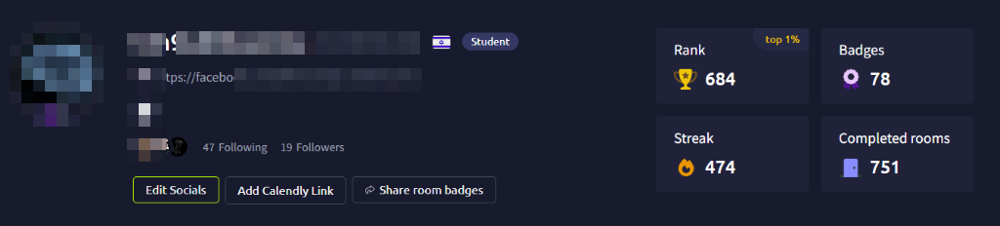

<div align="center">

# 🚩 TryHackMe Write-ups Collection

Welcome to my repository for **TryHackMe (THM)** CTF challenges and machine write-ups.

This repository serves as a structured collection of penetration testing, cloud security, and vulnerability exploitation write-ups, complete with execution logs, scripts, and remediation guidance.

---

## 👤 Operator Profile
*Identity, images, and social links redacted to maintain operational security.*



| Stat | Value |
|:---|:---|
| **Alias** | `[REDACTED]` |
| **Level** | `0x12 [SHOGUN]` (Level 17) |
| **Global Rank** | Top 1% (Rank ~680) |
| **Completed Rooms** | 750+ |
| **Badges** | 78 |
| **Current Streak** | 470+ Days 🔥 |

---

## 📁 Repository Structure

```text
TryHackMe-writeups/
└── hackerholidays/
    ├── Complimentary.md
    ├── Do Not Disturb.md
    ├── Easter_Egg.md
    ├── README.md
    ├── CryptoCabana.md
    ├── Towel on the Sunbed.md
    └── The Hollow Shell.md
```

---

## 📝 Available Write-ups

| Event / Category | Room / Challenge Name | Focus / Vulnerability Type | Write-Up Link |
| :--- | :--- | :--- | :--- |
| **Hacker Holidays** | **Complimentary** | AWS Cognito Unauthenticated Role & DynamoDB BOLA | [Read Write-Up](./hackerholidays/Complimentary.md) |
| **Hacker Holidays** | **Do Not Disturb** | Node.js NoSQLi, SSTI, PrivEsc via Disk Group | [Read Write-Up](./hackerholidays/Do%20Not%20Disturb.md) |
| **Hacker Holidays** | **Easter Egg** | OSINT, Base64 Decoding, Lore | [Read Document](./hackerholidays/Easter_Egg.md) |
| **Hacker Holidays** | **Towel on the Sunbed** | Business Logic, TOCTOU Race, API Abuse | [Read Write-Up](./hackerholidays/Towel%20on%20the%20Sunbed.md) |
| **Hacker Holidays** | **CryptoCabana** | Azure Storage SAS Leak, Key Vault Secret Versioning | [Read Write-Up](./hackerholidays/CryptoCabana.md) |
| **Hacker Holidays** | **The Hollow Shell** | Zip Slip → SSTI → RCE (Flask) | [Read Write-Up](./hackerholidays/The%20Hollow%20Shell.md) |

---

## ⚖️ Disclaimer

All write-ups, scripts, and commands documented in this repository are created strictly for educational purposes and authorized security research on CTF platforms.

</div>
