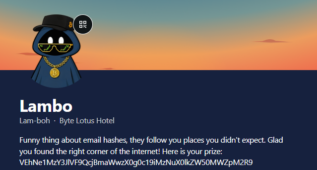

# Hacker Holidays: Day 6 - Overheard at Breakfast

> 📝 **Write-up credit:** Based on the English write-up by [`shelvy1337` (Cybersecurity-Writeups)](https://github.com/shelvy1337/Cybersecurity-Writeups/tree/main/TryHackMe/Hacker%20Holidays%202026) and used with attribution per that repository's terms. Flag values are censored as `THM{REDACTED}` per this repository's convention.

---

> A screenshot of an overheard breakfast conversation turns out to be the entire puzzle. In a single message Lambo mentions a free profile-linking service starting with the letter **G** and also gives away an email address. Connecting those two clues leads straight to a hidden **Gravatar** profile, whose bio holds a Base64-encoded flag.

## Quick Overview

| Field | Value |
| --- | --- |
| Platform | TryHackMe |
| Event | Hacker Holidays 2026 |
| Day | 6 |
| Category | OSINT |
| Difficulty | Easy |
| Techniques | OSINT, Social Media, Email Hashing, Gravatar, Base64 |
| File | `conversation.png` |

## Objective

The goal was to analyze a conversation screenshot and use the details inside it to hunt down an account no one was supposed to find.

The briefing tells the story of a guest who lingers at a breakfast table, catches a private moment, and grabs a screenshot before the messages disappear. The `@0xMia` hint is explicit about the method: actually read what was said, do not just skim the picture.

## Attack Path

1. I downloaded `conversation.png` from the task files.
2. I read the chat between `Ponzi` and `Lambo` word by word.
3. I extracted two key details: a free tool starting with the letter `G`, and the email `lambobytelotushotel@gmail.com`.
4. I identified the "G" tool as Gravatar.
5. I looked up the email on Gravatar.
6. I opened the resulting profile and spotted a Base64 string in the bio.
7. I decoded it with CyberChef and submitted the flag.

## Recon

The `@0xMia` hint tells you exactly where to look:

```text
"the breakfast crowd really said the quiet part out loud this morning 😭
y'all need to actually READ what they said, not just skim it"
```

This is the theme of the whole room: no hidden directories, no encoded binaries. Everything sits in the literal text of the chat, and the challenge is designed to stop you from skimming.

The attachment is a screenshot of a Discord conversation between two guests:

<p align="center">
  
</p>

```text
Ponzi - Influencer   (handle: L3AK)
Lambo
```

## Reading the Conversation

The relevant exchange goes roughly like this:

> Ponzi: "I never ended up getting your handle, so I could possibly tag you next time."
> Lambo: "I don't really use much social media... I used to use this free tool that let me upload my profile and link other media accounts... Started with a G if I remember correctly."
> Lambo: "... this is my best way of communication: lambobytelotushotel@gmail.com"

Two details stand out:

- a free service starting with `G`, described as a place to upload a profile and link other media accounts;
- the email `lambobytelotushotel@gmail.com`.

On their own both look harmless, but together they close the case.

## Identifying the Platform

A free tool "starting with G" that lets you build a profile and connect your other social accounts strongly suggests:

```text
Gravatar
```

Gravatar is a free service that stores one public profile (avatar, bio, links to social channels) and associates it with an **email address**. That profile-to-email binding is exactly what makes Gravatar valuable for OSINT.

## Locating the Profile by Email

The key property: a Gravatar profile can be looked up by the email it is linked to. The profile identifier is a hash of the address (SHA-256 of the normalized email in recent Gravatar versions):

```text
https://gravatar.com/{sha256(email)}
```

You do not have to compute the hash manually. The Gravatar search / email checker accepts the address directly and returns the associated public profile when one exists.

Submitting `lambobytelotushotel@gmail.com` returns a public profile. This profile is exactly the hidden account mentioned in the briefing. Its URL is:

```text
https://gravatar.com/cheerfullysongf28e3c3716
```

## The Profile and the Bio

The profile identifies the user as:

- display name: `Lambo`
- location: `Byte Lotus Hotel`
- a bio containing a long string of characters

<p align="center">
  
</p>

The bio string has the classic shape of **Base64**: alphanumeric characters plus possible `=` padding. That is the final step.

## Decoding with CyberChef

Open [CyberChef](https://gchq.github.io/CyberChef/) and apply a single operation:

```text
From Base64
```

Base64 is encoding, not encryption, so every correct reader produces the same output.

## Flag

The decoded value is the room flag in `THM{...}` format:

```text
THM{REDACTED}
```

The bio string decodes into the room flag. After submitting it, the room reports completion:

**Flag:** `THM{REDACTED}`

## Why It Works

The room is built on three simple principles:

1. **An email is an identifier.** We treat addresses as private, but an email is one of the strongest identity indexes online and can be tied to many services.
2. **The "G" tip points at Gravatar.** Knowing the platform and the address makes pulling public data from a profile trivial.
3. **Base64 is not encryption.** Any user who copies the string and decodes it reaches the flag.

Finally: chat screenshots are public, and people leak sensitive details in them. One line combined with a linked profile can reveal a person's hidden side.

## How To Protect Yourself

- Do not share your primary email address in public conversations.
- Remember that an email hash is an identifier, not anonymization.
- Audit old public profiles (Gravatar, link-in-bio tools) and remove ones you no longer use.
- Avoid reusing the same identity (nickname, email, avatar) everywhere.
- Treat any chat screenshot as public material, because that is exactly how it will be used in an OSINT investigation.

## Summary

Day 6 of Hacker Holidays 2026 is a pure OSINT room. Reading the conversation carefully gives us a single email plus a "G" hint, and pairing those leads to a Gravatar profile. Its bio contains a Base64 string that decodes into the flag.

The core idea: read the chat, connect `email + tool starting with G` → Gravatar, decode the Base64, submit the flag.
