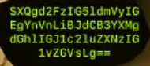
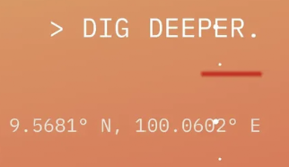

# 🥚 Hacker Holidays 2026: Easter Egg Discovery

While exploring the inner workings of the "Byte Lotus" resort during the TryHackMe Hacker Holidays event, we stumbled upon an interesting set of Easter Eggs hidden within the challenge files.

Here is the documentation and decoding of our discovery.

---

## 🕵️ The Hidden Transmission

Deep inside the application, we encountered a mysterious block of text encoded in Base64:



```text
SXQgd2FzIG5ldmVyIGEgYnVnLiBJdCB3YXMgdGhlIGJ1c2luZXNzIG1vZGVsLg==
```

### Decoding the Message
Using standard Base64 decoding, we reveal the hidden message left behind by the creators (or perhaps by the Advanced Persistent Threat currently moving through the hotel):

```bash
$ echo "SXQgd2FzIG5ldmVyIGEgYnVnLiBJdCB3YXMgdGhlIGJ1c2luZXNzIG1vZGVsLg==" | base64 -d
```

**Decoded Text:**
> **"It was never a bug. It was the business model."**

This eerie quote implies that the vulnerabilities at the Byte Lotus aren't accidental misconfigurations—they are intentional backdoors designed to profit off the guests' compromised data. VERA, the AI concierge, might be operating exactly as designed.

---

## 🗺️ Dig Deeper: The Coordinates

Following the trail, a subsequent screen prompted us to `> DIG DEEPER.` and provided a set of GPS coordinates:



```text
9.5681° N, 100.0602° E
```

### The Real-World Connection
If you plug these coordinates into Google Maps, they point directly to the tropical island of **Ko Samui, Thailand**.

**What does this mean?** 
This is a brilliant pop-culture reference by the TryHackMe team! "The Byte Lotus" resort is a direct homage to the hit HBO television series *The White Lotus*. Season 3 of *The White Lotus* is famously set and filmed in **Ko Samui, Thailand**. 

The TryHackMe creators seamlessly blended the lore of their cyber-security CTF event with the aesthetic and themes of the show—where wealthy, oblivious guests stay at a luxury resort while dark, underlying mysteries (and in this case, cyber attacks) unfold around them.

*A fantastic Easter Egg for fans of the show and a great bit of world-building for the event!*
